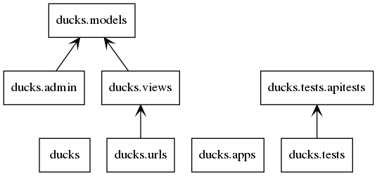
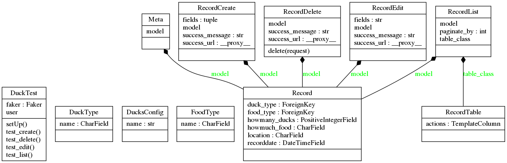
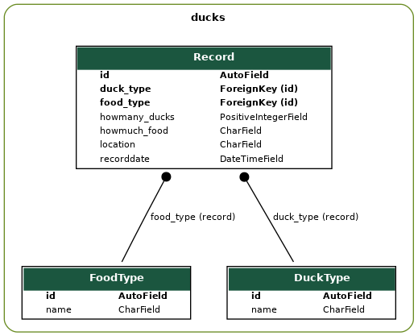

## website
[website ducktest 🦆](https://ducktest.python3.ninja)

## Approach

The problem what I understand its creation a system when everyone can register a
record of the feeding of ducks.

    * Record date
    * Duck type of feeding
    * Kind of the food
    * Location of the record
    * Quantify of ducks
    * Quantify of food

Then I write the CRUD of the application and introduce a small dashboard.

## Technology

I used Django with a lot of djangopackages:

check requirements.in file

Why ?
Well, I'm python developer. And I consider python ninja!

## Components

### Package

### Classes

django request-response https://i.stack.imgur.com/rLfSC.jpg

##  Database

## Hours ?

~ 15 hrs
[Check the log](Log.md)

